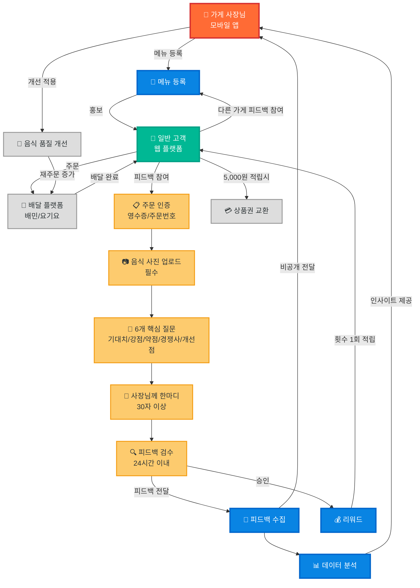

### 우리의 타겟

- 개업한 지 초기(1개월 미만)의 배달음식점 사장님
    - "내 음식이 손님들 입맛에 맞을까?" 가장 궁금한 시기
- 장사가 안되는데 이유를 모르는 사장님
    - 평점이 낮은데 구체적 이유를 모르는 경우
    - 개선 방향을 찾고 싶어하는 사장님들

# **우리의 핵심 목표**

- 음식점 사장님의 매출 증대 플랫폼 구축
- 비용 절감 + 매출 증대의 이중 솔루션 제공
    
    **매출 증대 전략**
    
    1. **비용 절감**: 전문가 촬영비 대신 가이드 기반 셀프 촬영
    2. **매출 증대**: 메뉴 홍보 및 고객 피드백 기반 메뉴 최적화로 매출 증대

## 기존 서비스

### **우리가 뭘 해왔나?**

- 배달 음식점 사진 촬영 도움 앱 개발

### **사장님들의 사진 촬영 어려움:**

- 사진의 각도/구도/배치 모름
- 플랫폼별 복잡한 규정 (배민 4:3, 쿠팡 18:11 등)
- 프리랜서 비용 부담 (30만원)

### **다음 STEP**

"사장님이 주문 유도 효과가 높은 사진 찍었다면, 다음 궁금증은?"

- 사진 = 수단 (주문 유도)
- 진짜 목적 = 고객 만족도
- **사진 좋아도 음식 별로면 재주문 없음**

## 사진 이후의 진짜 니즈 & 페인포인트

### **사장님들의 진짜 궁금증**

- "사진 보고 온 고객이 실제 음식 받고 실망 안 했을까?"
- "사진을 봤을 때의 기대와 현실이 비슷했을까?"
- "내 음식 맛에 문제는 없을까?"
- **"정성껏 만든 우리 음식을 손님들이 어떻게 생각할까?"**

### **기존 배달앱 리뷰의 한계**

- **배민/요기요 리뷰**: 리뷰 이벤트용 형식적 리뷰 ("맛있어요 ⭐⭐⭐⭐⭐")
- **건설적이고 구체적인 개선점 피드백의 부재**
    - 있어도 보통 낮은 별점으로 안좋은 말로만 남기기 때문에 매출 하락으로 이어짐
- **정보 비대칭**: 고객의 진짜 만족도와 구체적 개선점 파악 어려움
- **악성 리뷰 스트레스**: 감정적이고 근거 없는 별점 테러에 무방비 노출
- **공개 리뷰 부담**: 솔직한 피드백이나 낮은 평점을 받고 싶지 않음 (매출 직결)
- **마케팅 어려움**: 신규 가게나 매출이 적은 가게의 효과적 홍보 방안 부족

### **기존 피드백 시스템의 근본 문제**

- **리뷰 이벤트 문제**: 참여 고객이 반강제적으로 좋든 싫든 높은 평점을 남김
- **유의미한 내용 부재**: 실제 개선이 필요한 부분에 대한 구체적 피드백 없음

이 문제를 해결하자!

### 전체적인 서비스 플로우



## 핵심 가치 제안

### 1. 신뢰할 수 있는 비공개 진짜 피드백

- **완전 비공개 시스템**: 사장님만 피드백을 볼 수 있음. 어떤 고객이 썼는 지는 철저히 비공개 (물론 주문 여부는 검증)
- **악성 리뷰 차단**: 건설적(욕설/인신공격 없음 + 음식 관련 구체적 평가 포함) 피드백만 전달되는 건강한 환경
- **구체적 정보**: "맛있어요" 대신 간/맵기/양/가격 등 구체적인 세부 데이터
- 피드백은 결국 받아야하는데 안전한 환경(비공개)에서 충분히 실험을 하고 음식을 팔게 된다면 더 효과적일 것이다.

### 2. 리워드 기반 선순환 구조

- **고객 동기 부여**: 성실한(사진 업로드 + 필수 항목 모두 작성) 피드백 작성 시 리워드 지급 (건당 1,000원)
- **사장님 부담 제로**: 초기 리워드는 플랫폼에서 지원
- **사장님 매출 확보 :** 유저들은 음식을 시켜야 리워드를 받을 수 있기에 사장님은 매출을 확보할 수 있음.
- **지속적 참여**: 5,000원(5건) 이상 적립 시 범용 상품권으로 교환 가능

### 3. 데이터 기반 개선 인사이트 제공

- **메뉴별 상세 분석**: 각 메뉴의 강점/약점을 객관적 데이터로 제공
- **고객 성향 분석**: 어떤 고객층(나이, 성별 등)이 우리 가게를 선호하는지 파악
- **개선 방향 제시**: 축적된 데이터를 바탕으로 구체적 개선 제안
- **주관적 → 객관적 변환**: 개별 고객의 상대적 맛 평가가 다수 누적되면서 신뢰할 수 있는 경향성(동일 항목 10건 이상 응답 시 통계적 신뢰도 확보) 및 객관적 지표로 변환
- 유의미한 데이터 → 메뉴당 최소 10건 이상의 피드백 데이터
- 예시
    
    ### **김치찌개 50건 피드백 분석 예시:**
    
    ### **타겟 고객 분석**
    
    - 주 고객층: 20-30대 남성 64%
    - 마케팅 타겟 명확화
    
    ### **음식 피드백 분석**
    
    - 단맛 평균 2.8점 (44%가 단맛 부족)
    - 소비자의 65%가 덜 매웠으면 좋겠다고 답변
    - 양이 애매하다는 답변이 70% 이상
    
    ### **즉시 실행 가능한 개선안**
    
    - 양파 볶는 시간 늘려 단맛 보강
    - 순한맛/보통/매운맛 선택권 제공
    - 미니 사이즈 옵션 고려
- 프로토타입
    
    https://readdy.link/share/513a91217b371c5a531222bfcf0e3892
    

## 결론 : 사장님이 겪고 있는 문제를 부분적인 해결이 아닌 완전한 해결 가능

### → 캐치프레이즈 : 사장님이 매출을 늘리고 싶어하는 니즈를 처음부터 끝까지 완전히 해결해 드려요

## 서비스 구조 및 주요 기능

### 플랫폼 구성

- **고객용 웹 플랫폼**: 피드백 작성 및 리워드 관리
- **사장님용 모바일 앱**: 피드백 분석 및 인사이트 제공

### 고객용 웹 플랫폼 주요 기능

1. **간단한 피드백 작성 시스템**
    - 최대 3-4개 핵심 질문 (1-2분 내 완료 가능)
    - 대부분 선택지 클릭 방식 (텍스트 입력 최소화)
    - 음식 사진 업로드 + 간단한 코멘트
2. **리워드 관리**
    - 피드백 작성 시 즉시 1,000원 적립 → 횟수 적립
    - 5,000원(5건) 적립 시 범용 상품권 교환
    - 적립 현황 및 사용 내역 관리
3. **참여 제한 규칙**
    - 가게 당 최대 10명 선착순으로 피드백 참여 가능
    - 고객 당 한 가게의 한 메뉴 최대 1회만 피드백 가능
    - 다양한 가게/메뉴 시도를 통한 지속적 참여 유도

### 사장님용 모바일 앱 주요 기능

1. **피드백 대시보드**
    - 메뉴별 상세 평가 현황 (간/맵기/양/가격등)
    - 고객 만족도 트렌드 분석
    - 개선 필요 항목 우선순위 표시
2. **데이터 기반 인사이트**
    - 메뉴별 세부 데이터(맛, 양, 가격 등) 분석 결과
    - 재주문 가능성 예측
    - 고객층별 선호도 분석
3. **개선 제안 시스템**
    - 축적된 데이터 기반 구체적 개선 방향 제시
    - 성공 사례 및 벤치마킹 정보 제공
    - **경향성 분석**: "고객 100명 중 75%가 '조금 짜다'고 평가 → 염도 조절 필요" 등 실행 가능한 인사이트 제공

### **MVP 핵심 기능 구체화:**

**회원가입/인증 시스템**

- **필요성**: 횟수 적립, 중복 피드백 방지, 신뢰성 확보를 위해 필수
- **방식**:
    - 휴대폰 번호 인증 (간단하면서도 중복 계정 방지)
    - 소셜 로그인 (카카오/네이버) 추가 고려
- **수집 정보**: 휴대폰 번호, 닉네임 정도만 (최소한으로)

**횟수 관리 및 전환 시스템**

- **적립**: 피드백 완료 후 검증완료 즉시 1회 자동 적립
- **사용**: 5건 이상 피드백 완료 시 상품권 신청 가능
- **관리**: 간단한 교환 내역 페이지
- **상품권 발송**: 초기에는 수동으로 이메일/문자 발송

**피드백 작성 플로우**

1. **주문 인증**: 배달 주문 및 영수증 사진 또는 주문번호 입력
2. **음식 사진**: 받은 음식 사진 업로드 (필수)
3. **간단 설문**: 3-4개 핵심 질문 (선택지 클릭)
4. **한 줄 코멘트**: 자유 의견 (선택사항)
5. **완료**

### 구체적인 설문 내용 (페이지 별 정리)

- 도입부 (1페이지)
    
    [가게명] 사장님이 간절히 기다리고 있어요!
    
    "[음식]을 드신 분이 정말 어떻게 느끼셨을까?
    우리 음식이 손님 마음에 들었을까?"
    아무도 모르니까 마음껏 솔직하게 말씀해주세요 😊
    
    당신의 한 마디가 이 가게를 더 맛있게 만들어요!
    
    지금까지 이 가게는 ~~개의 소중한 피드백을 받았어요
    
- 설문 질문(2~3분 분량) (2페이지)
    - 텍스트
        
        ## 사전 질문 (리워드 받으려면 무조건 작성)
        
        - 성별, 연령대 등 개인정보
        - 평소 먹는 맵기 (1~5)
            - < 신라면 <  불닭 <
        - 평소 먹는 양
            - 평소 하루에 몇끼 먹는 지
            - 햄최몇(빅맥 기준)
            - 라면만 먹었을 때 몇 봉지 (1, 1.5, 2)
            - 치킨 한마리
        - 가격
            - 한끼 식사에 보통 얼마 쓰는 지
                - 단답으로 받고 우리가 판단하기
                - ~~0 ~ 7999~~
                - ~~8000 ~ 12999~~
                - ~~13000 ~ 19999~~
                - ~~20000 ~~~
        - 선호하는 음식 카테고리 (한식/중식/일식/양식/치킨/피자 등)
        
        ## 사후 질문
        
        ### 맛 피드백
        
        - 맵기, 단 정도, 짠 정도, 신 정도
        - 라디오 버튼 그룹으로 5단계 선택
        
        
        
        ### 양 피드백
        
        - 적다 적당하다 많다 5단계
        
        ### 가격 피드백
        
        - 싸다 적당하다 비싸다 5단계
        - 싸다 or 비싸다를 선택했을 경우 왜 그렇게 생각하는 지도 입력 받기
            - 양 대비 / 맛 대비 / 기타(직접입력)
        
        ### **사장님께 한마디**
        
        [가게명] 사장님이 간절히 기다리고 있어요!
        
        "[음식]을 드신 분이 정말 어떻게 느끼셨을까?
        우리 음식이 손님 마음에 들었을까?"
        아무도 모르니까 마음껏 솔직하게 말씀해주세요 😊
        
        당신의 한 마디가 이 가게를 더 맛있게 만들어요!
        
        지금까지 이 가게는 ~~개의 소중한 피드백을 받았어요
        
        **"사장님께 하고 싶은 말이 있다면? 여러분의 한마디가 가게를 살립니다." (30자 이상 필수)**
        
        예시 가이드:
        "국물이 진짜 진하고 좋았어요! 다만 김치가 조금 더 신선했으면..."
        "양이 정말 푸짐해서 놀랐어요. 다음에 또 시킬게요!"
        
        https://docs.google.com/forms/d/e/1FAIpQLSeFVLFRMmhy0G43xFNtmC0ad-Zer_49W2VCZyqYmMyS2Ylqlg/viewform
        
    - 설문 구조화
        
        ---
        
        ### **Phase 1: 당신의 입맛 알아보기 (입맛 프로필)**
        
        **Q1. 평소 즐겨 드시는 매운맛은 어느 정도인가요?**
        
        > ( ) 매운 음식은 거의 먹지 않아요. (0단계)
        ( ) 순두부찌개, 진라면 매운맛 정도 (1단계)
        ( ) 김치찌개, 신라면 정도 (2단계)
        ( ) 불닭볶음면, 엽기떡볶이 착한맛 정도 (3단계)
        ( ) 더 매운 음식도 즐겨요 (틈새라면, 엽기떡볶이 오리지널 등) (4단계)
        > 
        
        **Q2. 평소 식사량은 어느 정도이신가요? (1인분 기준)**
        
        > ( ) 0.7인분 이하 (조금만 먹어도 배불러요)
        ( ) 1인분 (딱 정량을 먹는 편이에요)
        ( ) 1.5인분 (든든하게 먹어야 만족스러워요)
        ( ) 2인분 이상 (누구보다 잘 먹을 자신이 있어요)
        > 
        
        **Q3. 보통 점심 식사로 얼마를 지출하시나요?**
        
        > ( ) 8,000원 미만
        ( ) 8,000원 ~ 12,000원
        ( ) 12,000원 ~ 15,000원
        ( ) 15,000원 이상
        > 
        
        ---
        
        **[설문 시작 전 인트로 화면]**
        
        > 🍜 [가게명] 사장님이 당신의 솔직한 피드백을 애타게 기다리고 있어요!
        > 
        > 
        > 오늘 식사는 어떠셨나요? 당신의 소중한 1분은 이 가게가 더 맛있어지는 데 큰 힘이 됩니다.
        > 
        > *이 피드백은 **사장님만 확인**하며, **완전 익명**으로 전달돼요.*
        > 
        > ```
        > 💝 [가게명] 사장님이 간절히 기다리고 있어요!
        > 
        > "[음식명]을 드신 분이 정말 어떻게 느끼셨을까?"
        > "우리 음식이 손님 마음에 들었을까?"
        > 
        > 사장님은 아무도 모르는 곳에서 정성껏 요리하고 계세요.
        > 당신의 솔직한 한 마디가 이 가게를 더 맛있게 만들어요! 😊
        > 
        > ※ 이 피드백은 사장님만 보실 수 있습니다 (완전 익명)
        > ※ 지금까지 이 가게는 [X]개의 소중한 피드백을 받았어요
        > ```
        > 
        
        ### **Phase 2: 오늘의 식사 경험 평가 (상대 평가)**
        
        **(진행률 바: 50% 진행)**
        
        “판단이 불가한 음식은 체크 안해도 됩니다” 라는 체크반스 존재 → 안매운 음식, 아이스크림 같은 거
        
        **Q4. {Q1 답변}을 기준으로, 오늘 드신 음식의 맵기는 어떠셨나요?**
        
        > 슬라이더(Slider) 방식 추천
        > 
        > 
        > > 훨씬 덜 매움 <─────⚪───────> 훨씬 더 매움 (리셋 버튼)
        > > 
        
        **Q4. 오늘 드신 음식의 달기는 어떠셨나요?**
        
        > 슬라이더(Slider) 방식 추천
        > 
        > 
        > > 단맛 거의 없음 <─────⚪───────> 많이 달콤함 (리셋 버튼)
        > > 
        
        **Q4. 오늘 드신 음식의 간은 어떠셨나요?**
        
        > 슬라이더(Slider) 방식 추천
        > 
        > 
        > > 많이 싱거움 <─────⚪───────> 많이 짬 (리셋 버튼)
        > > 
        
        **Q4. 오늘 드신 음식의 신맛은 어떠셨나요?**
        
        > 슬라이더(Slider) 방식 추천
        > 
        > 
        > > 신맛 거의 없음 <─────⚪───────> 많이 심 (리셋 버튼)
        > > 
        
        **Q5. 평소 드시는 양({Q2 답변})을 기준으로, 오늘 음식의 양은 어떠셨나요?**
        
        > 슬라이더(Slider) 방식 추천
        > 
        > 
        > > 훨씬 적었음 <─────⚪───────> 훨씬 많았음 (리셋 버튼)
        > > 
        
        **Q6. 비슷한 종류의 다른 음식과 비교했을 때, 가격은 어떻게 느끼셨나요?**
        
        > 슬라이더(Slider) 방식 추천
        > 
        > 
        > > 훨씬 저렴함 <─────⚪───────> 훨씬 비쌈 (리셋 버튼)
        > > 
        
        **Q6-1. (Q6에서 '저렴' 또는 '비쌈' 쪽으로 응답 시) 그렇게 느끼신 가장 큰 이유는 무엇인가요?**
        
        > ( ) 음식의 '양'에 비해서
        ( ) 음식의 '맛과 품질'에 비해서
        ( ) 가게의 '서비스나 분위기'에 비해서
        ( ) 기타: [직접 입력]
        > 
        
        ---
        
        ### **Phase 3: 종합 의견 및 제안 (핵심 인사이트)**
        
        **(진행률 바: 90% 진행)** "거의 다 왔어요! 마지막 의견을 들려주세요."
        
        **Q7. 이 음식을 다른 사람에게 추천할 의향이 얼마나 있으신가요? (0점: 절대 안 함 ~ 10점: 무조건 추천)**
        
        > NPS 0-10점 척도
        > 
        
        **Q8. 이 가게에서 이 메뉴를 다시 주문할 의향이 얼마나 있으신가요? (0점: 절대 안 함 ~ 10점: 무조건 다시 주문)**
        
        > NPS 0-10점 척도
        > 
        
        **Q9. 사장님께 딱 한 가지만 이야기할 수 있다면, 어떤 말을 해주고 싶으신가요?**
        
        > "이 음식이 '인생 메뉴'가 되려면, 어떤 점이 더해지면 좋을까요? 사장님께 살짝 팁을 알려주세요!"
        > 
        > 
        > `텍스트 입력 (30자 이상)`
        > 
        
        **Q10. 오늘 식사 경험에 대해 전체적으로 얼마나 만족하시나요?**
        
        > ( ) 매우 불만족
        ( ) 불만족
        ( ) 보통
        ( ) 만족
        ( ) 매우 만족
        > 
        
        **[마지막 감사 화면]**
        
        > 소중한 의견 정말 감사합니다!
        > 
        > 
        > 당신의 진심 어린 피드백 덕분에 [가게명]은 한 뼘 더 성장할 수 있을 거예요. 😊
        > 
        
- 필수 완성 조건
    - 체크리스트
        - 음식 사진 업로드(필수)
        - 질문 모두 답변(필수)
        - 사장님께 한마디 30자 이상 작성(필수)
        - 총 작성 시간 2분 이상(자동체크) → 필요하면
    - **진행률 표시**
        
        진행률: ████░░ 80% 완료!
        "거의 다 했어요! 사장님께 한마디만 남겨주세요 😊"
        
- 마지막 확인 (3페이지)
    
    🤝마지막 확인
    
    정말 솔직하게 답변해주셨나요?
    사장님이 이 피드백으로 음식을 더 맛있게 만들 수 있을까요?
    
    □ 네, 정말 솔직하게 썼어요
    □ 사장님께 도움이 될 거예요
    
    [피드백 제출하기] 버튼
    
- 완료 메세지 (4페이지)
    
    🎉 피드백 제출 완료!
    
    검수 완료 후 횟수 1회가 적립됩니다.
    보통 24시간 이내에 승인돼요!
    
    [가게명] 사장님께 소중한 조언을 전달했어요.
    당신 덕분에 이 가게가 더 맛있어질 거예요! 🙌
    
    현재 적립 횟수: 3회 / 5회 (최소 전환 횟수)
    [다른 가게 피드백 작성하기]